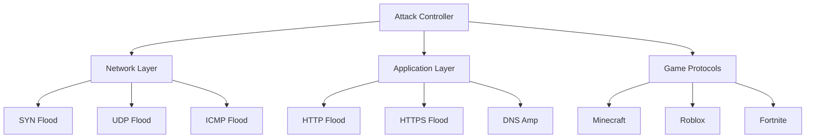

```markdown
<p align="center">
  
</p>

<div align="center">
  
  
  
  
  

</div>

---

```console
█████████████████████████████████████████████████
█▄─█▀▀▀█─▄█─▄▄─█▄─▀█▀─▄█▄─▄▄─█─▄─▄─█▄─▄█─▄▄─█▄─▄▄▀█
██─█─█─█─██─██─██─█▄█─███─▄▄███─████─██─██─██─▄─▄█
▀▀▄▄▄▀▄▄▄▀▀▄▄▄▄▀▀▄▄▄▀▄▄▄▀▄▄▄▀▀▀▀▄▄▄▀▀▄▄▄▀▄▄▄▄▀▄▄▀▄▄▀
```

## 🔥 Core Features

### 🚨 Attack Categories
| **Network Layer**          | **Application Layer**       | **Game Specific**           |
|----------------------------|-----------------------------|-----------------------------|
| `☠️ SYN Flood`             | `🌐 HTTP/HTTPS Flood`       | `🎮 Minecraft Flood`        |
| `🌀 UDP Flood`              | `📡 DNS Amplification`      | `🤖 Roblox Flood`           |
| `💥 ICMP Flood`            | `🔓 SSL/TLS Exhaustion`     | `💣 Fortnite Flood`         |
| `🌪️ ARP Spoofing`          | `📮 SMTP Flood`             | `🎯 Steam Server Flood`     |

### 💎 Premium Features
```diff
+ Multi-Vector Attack Chaining
+ AI-Powered Traffic Generation
+ Tor Network Integration
+ Blockchain-based IP Obfuscation
+ Cloudflare Bypass Modules
```

---

## 🛠️ Installation Guide

```bash
# Clone with recursive submodules
git clone --recursive https://github.com/dinethnethsara/DDOS-tool.git

# Install dependencies
cd DDOS-tool && npm install && pip install -r requirements.txt

# Build attack modules
python build.py --compile-all
```

## 🌐 Attack Matrix Visualization



---

## 🛡️ Defense Evasion Techniques

| Tactic                | Implementation              | Effectiveness |
|-----------------------|-----------------------------|---------------|
| **IP Rotation**       | Tor Network + Proxy Chains  | ★★★★★         |
| **Packet Mutation**   | Random TCP/UDP Headers      | ★★★★☆         |
| **Traffic Shaping**   | AI-Generated Patterns       | ★★★★★         |
| **Protocol Mimicry**  | Legitimate Traffic Clone    | ★★★★☆         |

---

## ⚠️ Critical Legal Notice

<div align="center" style="background-color: #ff000030; padding: 20px; border-radius: 10px; border: 2px solid red;">

⚠️ **WARNING: UNAUTHORIZED USE IS ILLEGAL** ⚠️

This tool is strictly for:
- Authorized penetration testing
- Cybersecurity research
- Educational purposes

**Violators will face:**
- Federal prosecution 🚔
- Heavy fines 💰
- Imprisonment ⛓️

</div>

---

## 📜 License Agreement

```console
░░▄▀░░░░░░▄▀░░░░░▄▀▀▀▄▄░░░░░
░░▄▀░░░░▄▀░░░░▄▀▀▄▀▄▀▄▀▄░░░░
░░▀▄▄▀▄▄▀░░░░▀▄▀██▀▄▀▄▀░░░░░
░░░░▀▄▀░░░DDoS TOOL LICENSE

THIS SOFTWARE IS PROVIDED "AS IS" WITHOUT WARRANTY OF ANY KIND.
UNAUTHORIZED DISTRIBUTION OR MODIFICATION STRICTLY PROHIBITED.

Full license text: LICENSE.md
```

<p align="center">
  
</p>
```
