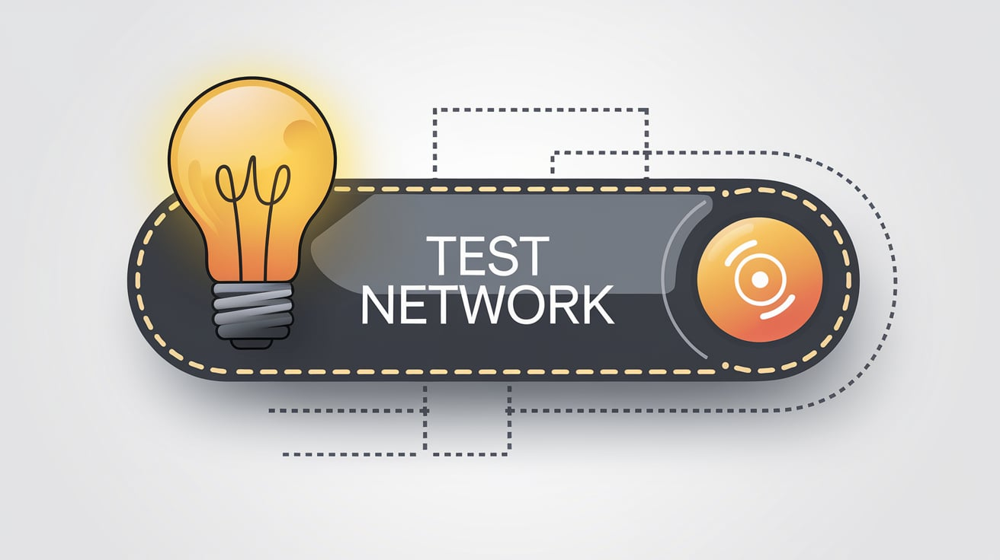

# 🌐 Ethical Network Testing Tool

<div align="center">

[](https://git.io/typing-svg)


</div>

<div align="center">

`🔒 PROFESSIONAL NETWORK TESTING SUITE 🔒`

</div>

---

<div align="center">


## ✨ Feature Set

</div>

<table align="center" style="border-radius: 10px; overflow: hidden;">
<tr>
<th width="33%" align="center">🛡️ Core Features</th>
<th width="33%" align="center">🚀 Performance</th>
<th width="33%" align="center">⚙️ Controls</th>
</tr>
<tr>
<td>

```yml
SYN Flood:
  - Resource Testing
  - Connection Analysis
UDP Flood:
  - Port Verification
  - Packet Management
```

</td>
<td>

```yml
HTTP/S Flood:
  - Server Testing
  - Load Analysis
Rate Limiting:
  - Custom Control
  - Precision Timing
```

</td>
<td>

```yml
GUI Interface:
  - Real-time Monitor
  - Dynamic Control
  - Visual Feedback
  - Status Updates
```

</td>
</tr>
</table>

---

<div align="center">

## 🎯 Quick Setup

</div>

<div align="center">

```bash
# Installation
$ npm install

# Launch
$ npm start
```

</div>

<details>
<summary><b>🔧 Detailed Setup Guide</b></summary>

### Environment Setup
```bash
# Clone repository
git clone https://github.com/user/network-tool.git

# Navigate to directory
cd network-tool

# Install dependencies
npm install

# Configure settings
cp .env.example .env

# Start application
npm start
```

</details>

---

<div align="center">

## 🛠️ Testing Methods

</div>

<table align="center">
<tr>
<td>
<details>
<summary><b>🎮 Game Services</b></summary>

### Minecraft Testing
```yaml
Target: example.com
Mode: Login/Chat Flood
Rate: 50 pps
```

### Roblox Testing
```yaml
Target: example.com
Mode: Login/Chat Flood
Rate: 50 pps
```

### Fortnite Testing
```yaml
Target: example.com
Mode: Login/Chat Flood
Rate: 50 pps
```

</details>
</td>
<td>
<details>
<summary><b>🔒 Security</b></summary>

### Network Layer
```yaml
Target: example.com
Modes:
  - ICMP Flood
  - DNS Amplification
  - SSL Exhaustion
Rate: 50 pps
```

### Infrastructure
```yaml
Target: example.com
Modes:
  - Port Scan
  - ARP Spoofing
Rate: 50 pps
```

</details>
</td>
</tr>
</table>

---

<div align="center">

## ⚠️ Usage Notice


```
🔒 AUTHORIZED TESTING ENVIRONMENTS ONLY 🔒
```

</div>

### Intended Use:
- ✅ Authorized Testing
- ✅ Educational Research
- ✅ Security Analysis
- ✅ Network Assessment

### Prohibited Use:
- ❌ Unauthorized Testing
- ❌ Malicious Activities
- ❌ Harmful Intent
- ❌ Service Disruption

---

<div align="center">

## 📜 License Information

[](LICENSE)

<kbd>
<b>Project Status:</b> Active Development
</kbd>

</div>

---

<div align="center">

### Quick Links

<kbd>[📚 Docs](docs)</kbd> • <kbd>[🐛 Issues](issues)</kbd> • <kbd>[✨ Features](features)</kbd>

### Connect With Us

[](https://github.com)
[](https://discord.gg)

<br/>

**Built with 💻 for Network Security Research**

```
Version 2.0.0 | Last Updated: January 2025
```

</div>
